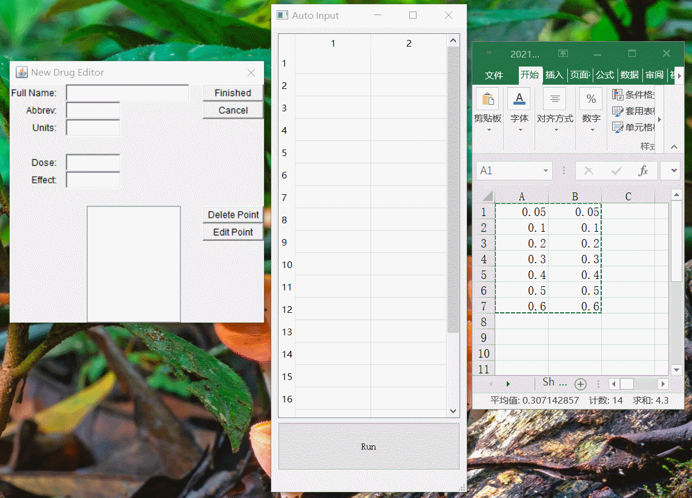
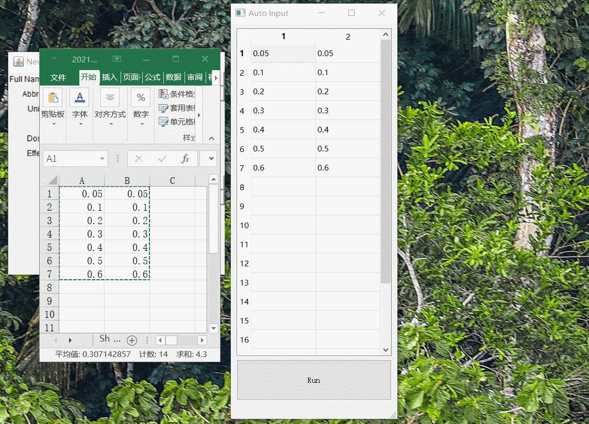

# AutoInput for CompuSyn
## 概述
Compusyn是药学分析上常用的一个软件，使用该软件进行数据输入时十分麻烦，只能一个数据一个数据地输入，不能使用excel导入，这使用户带不得不进行大量的重复操作。该项目使用pyautogui与pyqt5实现了针对CompuSyn的自动输入功能，方便用户快速输入数据。
## 功能
软件会自动查找dose输入框与effect输入框，查找成功后将数据导入。

查找成功：

查找失败：

## 注意事项
1.改变CompuSyn窗口大小或者更改系统分辨率等原因会使查找失败。当确认CompuSyn窗口在界面可视范围内后，查找依然失败时，需要手工截取dose输入框与effect输入框的截图，截图区域可以参考原有图像。

2.祝科研顺利 o(*￣▽￣*)ブ